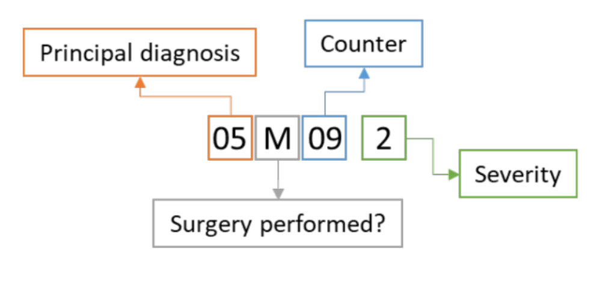

# Health Trajectory Analysis in Heart Failure Patients

## Overview
This repository contains the code for the paper [A novel methodological framework for the analysis of health trajectories and survival outcomes in heart failure patients](https://arxiv.org/abs/2403.03138).

## Methodological Framework

The initial step involves applying sequential pattern mining to characterize patients' trajectories, followed by an unsupervised clustering algorithm based on a new metric for measuring the distance between hospitalization diagnoses. Finally, a survival analysis is conducted to assess survival outcomes.

  

## Significance

The application of this framework to HF patients from a representative sample of the French population demonstrates its methodological significance in enhancing the analysis of healthcare trajectories.

## Contributors
**Authors:** T. Amadei, T. Kirscher, A. Klein \
**Supervisors:** Dr. A.-I. Tropeano, J. Murris \
_AP-HP_ / _INRIA_ & _INSERM_
