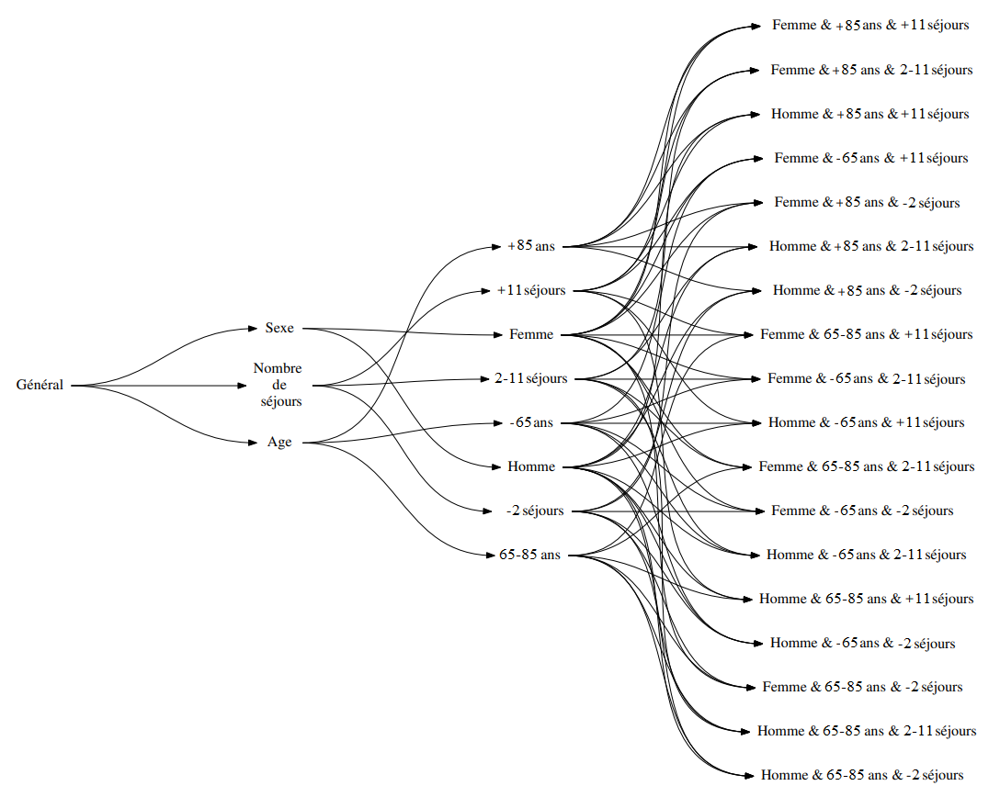

# Text Mining et parcours de soin

## Projet StatApp - ENSAE 2023

### Quelles sont les causes de mortalité des patients insuffisants cardiaques ?

**Encadrantes:** Dr. Anne-Isabelle Tropeano, Juliette Murris

*AP-HP & INSERM*

Il s'agit d'étudier les parcours de soins des patients insuffisants cardiaques à travers l'étude des motifs séquentiels, aussi appelé *sequential pattern mining.*
Ainsi, à l'aide des codes GHM (Groupe Homogènes de Malade) caractérisant les hospitalisations, il est possible de trouver des similarités dans les parcours de soins.

#### *Diagramme de relation entre entités des différentes bases de données*

#### *Diagramme des contextes patient divisant la population en 18 clusters hétérogènes*

